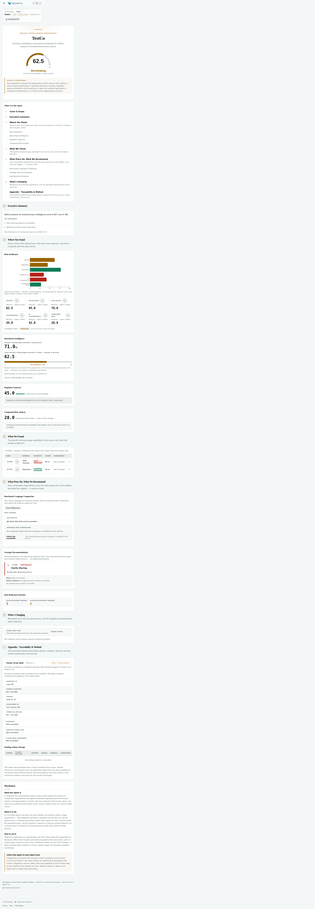
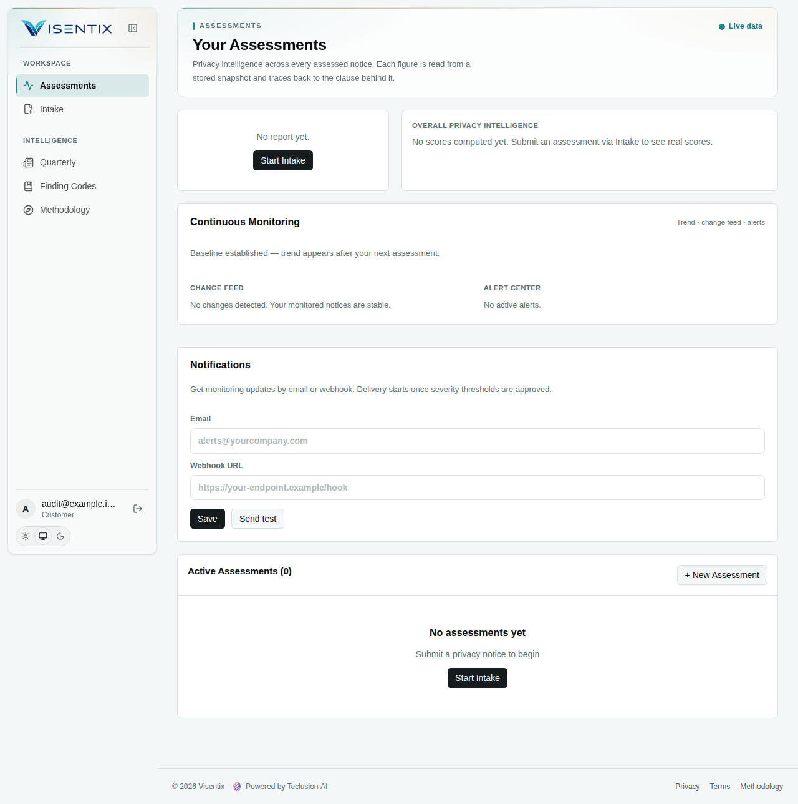
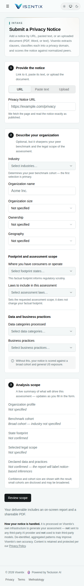
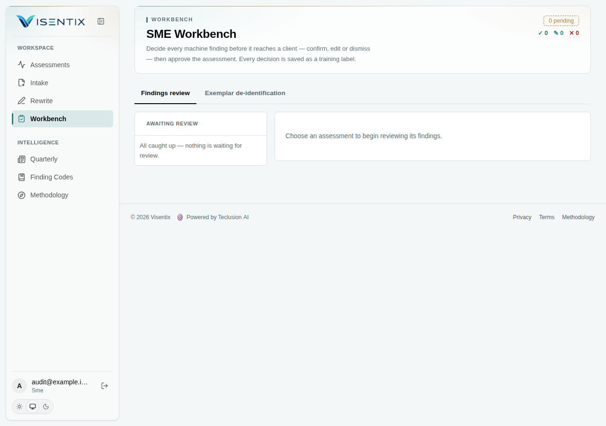
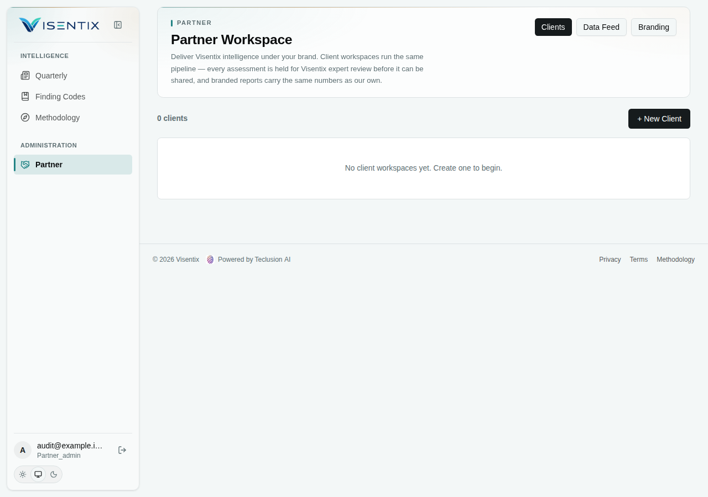
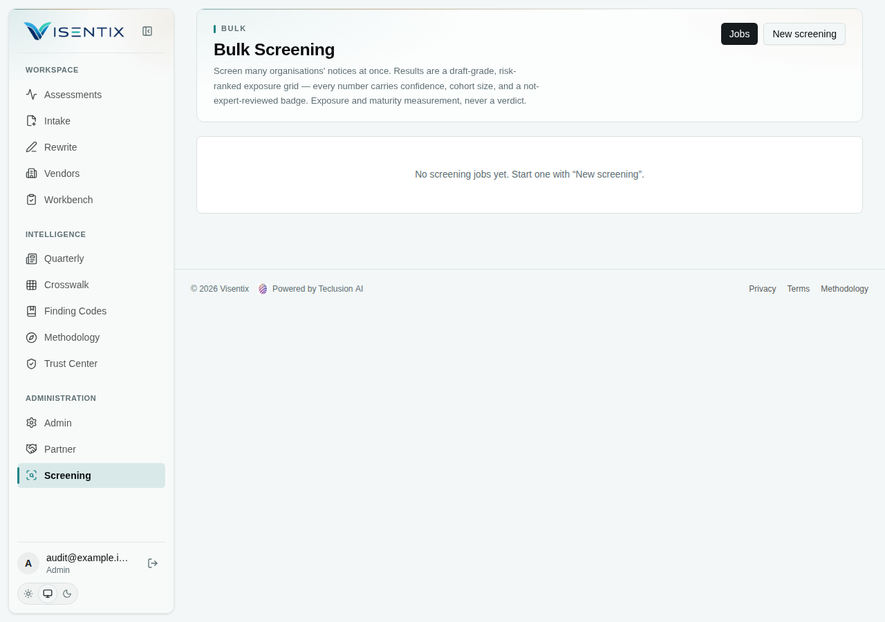
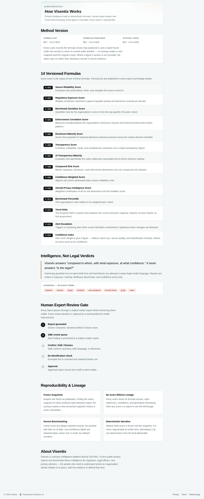
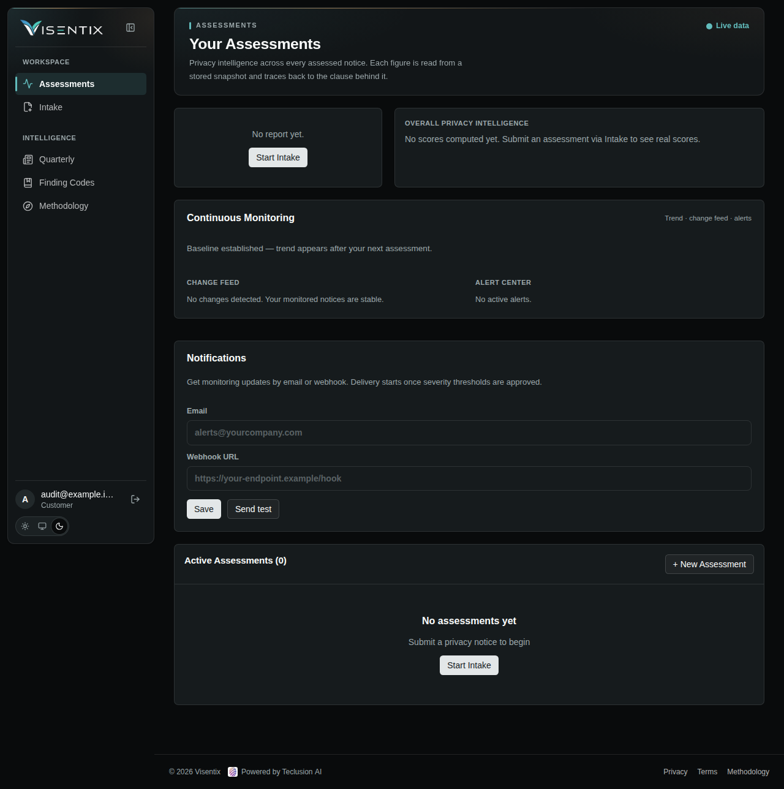

# UI evidence — 2026-09-08

All figures and identities in screenshots are isolated test fixtures, not product or corpus claims. See the [audit](../2026-09-08-ui-and-app-truth.md) for findings and coverage limitations. JSON lists all 78 light captures and eight dark diagnostic checks. Only selected screenshots are retained; other screenshot names refer to temporary audit artifacts.

Reproduction: run the Vite dev server on localhost with VITE_PREVIEW_SURFACES=true; use a disposable browser context with dummy session/profile localStorage, intercept every nonlocal request, and load the existing Report.test.tsx fixture for the report. Inspect at 375/768/1280px. No production identity or API is necessary. The signed-in browser check verifies rendering, not server authorization.
